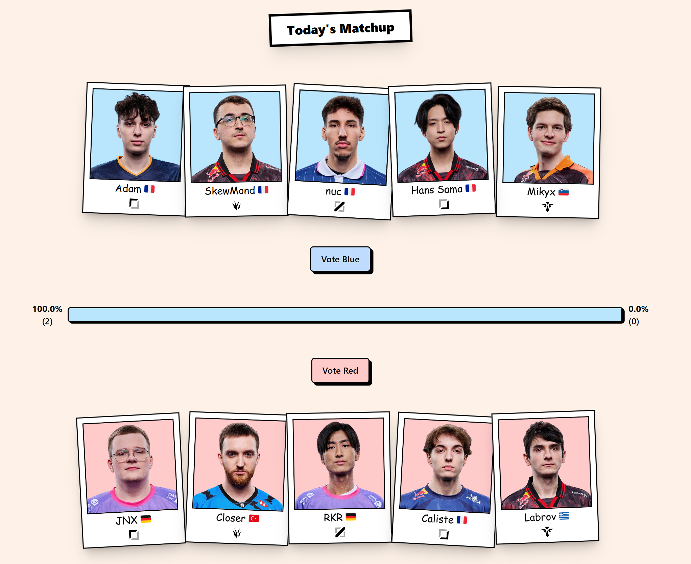

# Random Roster

A web application that allows users to vote on hypothetical matchups between professional League of Legends players.

🌐 Live Demo: https://random-roster.onrender.com/

## 📝 Description

This application randomly generates two teams of 5 professional players, one for each role, and lets users vote for the team they think would be stronger. It currently features players from the European league (LEC).

## 🛠️ Project Architecture

The frontend is organized using a feature-based structure for better maintainability and the backend follows a clear separation of concerns.

### ✨ Current Features

- Random generation of teams each day
- Login with OAuth
- Voting system
- Comments section

## 🚧 Project Status

The project is currently under development.

### Frontend :

- React 18 with Typescript
- Styling with Tailwind CSS
- React Query
- Routing with React Router

### Backend :

- Node.js with Express
- Typescript
- RESTful API
- PostgreSQL with Drizzle ORM
- Zod validation
